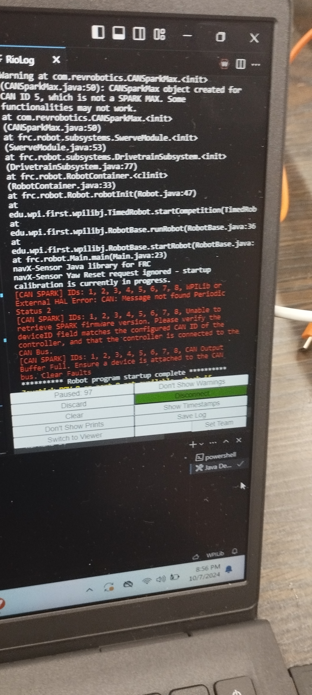

# Problems

## Cable Connection Issue

### Initial Symptoms 

* . Error in VS code when the code is deployed:

* . Can bus was giving error when ran with RevClient

### Trouble Shooting Safety

* glasses
* robot raised
* anything else to make sure you safely do trouble shooting and do not damage yourself, other students, electronics, motors, or hardware.

### Trouble Shooting Steps

Initial Trouble Shooting
* To find the CanSparkMax each one is checked seperately
  * The issue was found to be in the last CanSparkMax in the sequence

Additional Trouble Shooting
* Checked each of the cables for any problem
    * Found out the final cable that connects the last CanSparkMax to RoboRIO was broken

* Finally, changed the signal cable and the problem was fixed

Final Resolution
* First there was an error related to canSparkMaxes and canBus
  * The signal color of the CanSparkMax was the following:

  
  
    * Figured out one of the cables is broken and changed it, which fixed the issue

