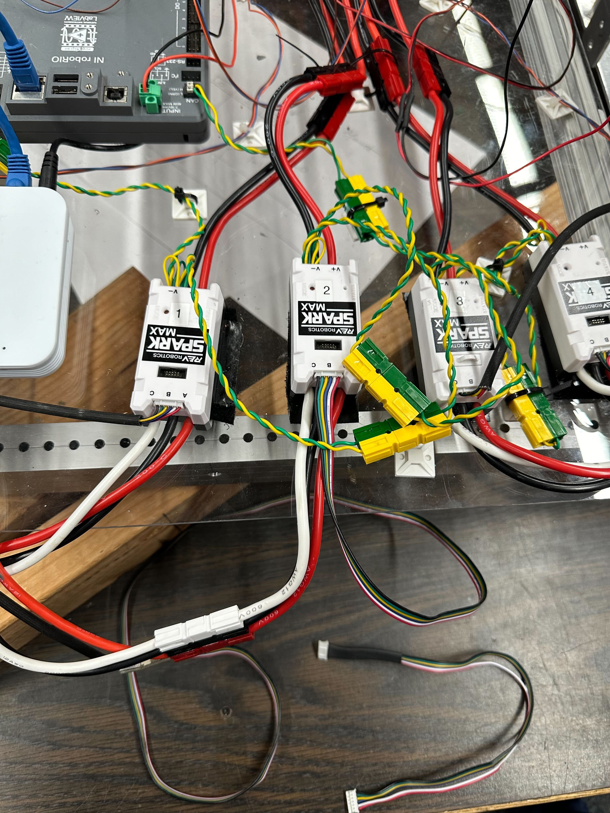

# Problems

## Low voltage in RevClient

### Initial Symptoms 

* . Error in VS code when the code is deployed:

* .Can bus was giving error when ran with RevClient

### Trouble Shooting Safety

* glasses
* robot raised
* anything else to make sure you safely do trouble shooting and do not damage yourself, other students, electronics, motors, or hardware.

### Trouble Shooting Steps

Initial Trouble Shooting
* One of the CanSparkMaxes had around 1V of power instead of 12V
  * All the others were working fine and when that CanSparkMax was taken out from the system the CanBus error was gone.
* Checked through the cables and take a look at each of the cables voltage

Additional Trouble Shooting
* When run the motor that is connected to the broken CanSparkMax it didn't run
    * When the CanSparkMax connected to the motor was unplugged the error disappeared

* Finally, changed the encoder cable and the issue with CanSparkMax was fixed and the motor was working fine.

Final Resolution
* First there was an error related to canSparkMaxes and canBus
  * CanBus was giving error related to low voltage
    * Encoder cable was broken and the issue was fixed by changing the encoder cable.

====================